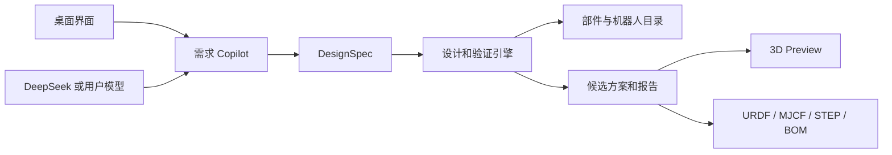

# Robot Design Copilot

[English](README.md) | [简体中文](README_zh.md)

> 描述你需要的机器人，与 AI 一起细化需求，再用工程工具验证设计。

Robot Design Copilot 是一个开源、跨平台的机器人概念设计助手。它将自然语言需求转换为结构化规格，评估候选设计，并推荐关节部件和满足要求的现有机器人。

首批支持的设计对象：

- 7 轴机械臂
- 轮式双臂机器人

> [!NOTE]
> 项目目前处于方案设计和早期开发阶段，暂时还没有可安装的 Release。

## 核心理念

**AI 提出方案 -> 工程工具验证 -> 用户做出决定。**

大模型负责理解需求、追问和解释；确定性工具负责几何、运动学、动力学、优化和部件兼容性计算。版本化的 `DesignSpec` 是项目的事实来源，而不是聊天记录。

## 计划功能

- 对话式需求细化和可编辑的工程参数
- 工作空间、奇异点、碰撞、速度和关节载荷分析
- 电机、减速器、驱动器、制动器和轴承推荐
- 连杆长度和部件组合优化
- 显示假设、安全余量和数据来源的可解释推荐
- 使用同一份需求匹配现有机器人
- 展示关节、工作空间、约束和轨迹的交互式 3D Preview
- 导出 JSON、BOM、报告、URDF、MJCF、glTF 和 STEP/STL
- 发布 Windows、macOS 和 Linux 桌面版本

## 工作流程

1. 选择机器人类型并描述任务。
2. 与 AI 助手一起补充缺失需求。
3. 审查生成的 `DesignSpec`。
4. 生成并验证候选设计。
5. 比较部件、设计方案和现有机器人。
6. 在 3D 中预览并导出结果。

## 系统架构

## 推荐技术栈

| 层级 | 技术 |
| --- | --- |
| 桌面端 | Tauri 2 / Rust |
| 界面和 3D | React、TypeScript、Three.js |
| 工程核心 | Python、Pinocchio、NumPy、SciPy |
| 本地 API 和数据模型 | FastAPI、Pydantic |
| CAD 和仿真 | CadQuery、MuJoCo |
| 存储 | SQLite |

项目默认提供 DeepSeek 配置预设。用户需要提供自己的 API Key，也可以接入自定义 OpenAI-compatible API 或本地 Ollama 模型。密钥将安全存储，不会内置在 Release 中。

## MVP

- [ ] 需求和 `DesignSpec` 数据模型
- [ ] DeepSeek 和自定义模型接入
- [ ] 参数化 7 轴机械臂
- [ ] 运动学、工作空间和基础关节载荷计算
- [ ] 经过整理的电机与减速器目录
- [ ] 可解释的部件推荐
- [ ] 简化的交互式 3D Preview
- [ ] JSON、BOM、报告和 URDF 导出

## 安全说明

Robot Design Copilot 是工程辅助工具，不是认证机构。设计方案在采购、制造或运行前，必须由具备相应经验和资质的工程师审查。

## 参与贡献

项目目前处于早期阶段，欢迎贡献需求模型、验证算例、部件数据、机器人算法、3D 可视化、跨平台打包和文档。

## 许可证

本项目采用 [Apache License 2.0](LICENSE) 开源许可证。

