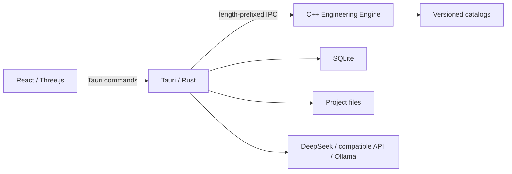

# Architecture Overview

Robot Design Copilot is a local-first desktop application. AI refines requirements and explains results. The C++ engine produces deterministic calculations. The user approves requirements and design decisions.

## Runtime



## Data flow

```text
User description
  -> DesignSpecPatch
  -> schema validation
  -> user approval
  -> DesignSpec revision
  -> CandidateDesign
  -> AnalysisResult
  -> Recommendation
  -> DecisionRecord
  -> ExportArtifact
```

## Boundaries

1. React does not access SQLite, the filesystem, or the C++ engine directly.
2. Rust does not duplicate C++ engineering algorithms.
3. The C++ engine does not store API keys or call language models.
4. AI cannot write an accepted `DesignSpec` directly.
5. Cross-language interfaces use versioned data contracts, not private language types.
6. The engineering core uses SI units.

See [ADRs](../adr/README.md) for decisions and the [roadmap](../project/roadmap.md) for delivery order.
