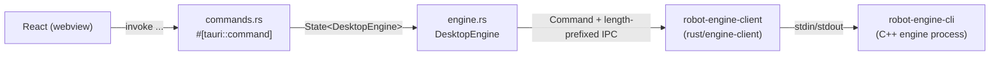

# `src-tauri/` Desktop Shell

`src-tauri/` is the Rust half of the Tauri 2 desktop application: the native
container that opens a window, embeds the React frontend, owns the C++ engine
child process, and is the only thing the user runs. The frontend half of the app
lives at the repository root (`src/`, `vite.config.ts`) and is compiled by Vite
into `dist/`, which Tauri loads into the webview.

This is the concrete, file-by-file companion to the conceptual
[architecture overview](overview.md) and the decisions in
[ADR-0002 (cpp-sidecar-ipc)](../adr/0002-cpp-sidecar-ipc.md) and
[ADR-0004 (tauri-command-boundary)](../adr/0004-tauri-command-boundary.md).

## Layout

```text
src-tauri/
├── Cargo.toml              Rust manifest: crate name, edition 2024, dependencies
├── Cargo.lock              Rust dependency lockfile (mirrors pnpm-lock.yaml)
├── tauri.conf.json         App config: window, CSP, bundle target, frontend wiring
├── build.rs                Build script; one call to tauri_build::build()
├── binaries/               Sidecar staging dir (gitignored); see "Sidecar" below
├── capabilities/
│   └── default.json        Tauri 2 permission grant for the main window
└── src/
    ├── main.rs             Binary entrypoint; delegates to lib::run()
    ├── lib.rs              App assembly: plugins, state, command registration
    ├── commands.rs         #[tauri::command] handlers exposed to React (IPC edge)
    └── engine.rs           Engine sidecar lifecycle + JSON request/response
```

## What `pnpm tauri dev` / `build` does

`tauri-cli` reads `tauri.conf.json` and orchestrates both halves:

| Config key | Effect |
| --- | --- |
| `build.beforeDevCommand: "pnpm dev"` | Before dev: start the Vite dev server |
| `build.devUrl: "http://localhost:5173"` | Dev: webview loads the live Vite URL |
| `build.beforeBuildCommand: "pnpm build"` | Before release: produce `dist/` via Vite |
| `build.frontendDist: "../dist"` | Release: embed `dist/` into the native binary |
| `bundle.externalBin` | Ship `binaries/robot-engine-cli` as a sidecar |

It then runs `cargo build` against this directory. The native binary produced
under `src-tauri/target/.../robot-design-copilot-desktop` is the shippable
artifact. Note this only names the frontend wiring; it is not where the
frontend code lives.

## Frontend ↔ Rust ↔ Engine call flow

Three commands are the only IPC surface exposed to React, registered in
`src/lib.rs` and implemented in `src/commands.rs`:



- `engine_health` → `engine.health()` → sends `engine.health` request.
- `forward_kinematics` → `engine.forward(req)` → validates finite joint angles,
  then sends `kinematics.forward` with `joint_positions_rad`.
- `restart_engine` → `engine.restart()` → shuts the current child down and
  spawns a fresh one.

## Sidecar lifecycle (`engine.rs`)

`DesktopEngine` wraps a `tauri::AppHandle` and a lazily-spawned engine client:

- **Lazy spawn.** `client()` returns the running client, or spawns one via
  `spawn()` on first use or after the previous process exited. `restart()`
  forces a shutdown + respawn.
- **Sidecar resolution.** `spawn()` uses `tauri_plugin_shell::ShellExt::sidecar`
  with `SIDECAR_NAME = "robot-engine-cli"`, so Tauri resolves the
  `robot-engine-cli-$TARGET_TRIPLE` binary that `bundle.externalBin` declares.
  The resolved Tauri sidecar command is converted into a standard
  `std::process::Command` and handed to `robot-engine-client`, which owns piped
  streams and shutdown (per ADR-0002 / ADR-0004).
- **Timeouts.** `REQUEST_TIMEOUT = 3s`, `SHUTDOWN_TIMEOUT = 2s`.
- **Structured errors.** Transport and protocol failures map to a serializable
  `CommandError { code, message, retryable, details }` (e.g. `engine_timeout`,
  `engine_exited`, `engine_protocol`) rather than leaking raw Rust/process errors
  to the webview.
- **Cleanup.** `RunEvent::Exit` in `lib.rs` and `Drop` both call `shutdown()` so
  the child is never orphaned.

## Capabilities (`capabilities/default.json`)

Tauri 2 gates native access behind an explicit permission model. The default
capability grants only `core:default` to the `main` window — plus the three
commands registered in the `invoke_handler`. The webview holds no shell
capability, so it cannot spawn processes or bypass the Rust lifecycle owner
(see ADR-0004). Adding file system, notification, or clipboard access later is a
matter of extending this file, not the command code.

## Sidecar staging (`binaries/`)

`binaries/` is a staging directory, not a source of truth. `scripts/stage-sidecar.py`
copies the built engine executable here as
`robot-engine-cli-$TARGET_TRIPLE` (plus `.exe` on Windows); staged binaries are
gitignored and the C++ source / lockfiles remain authoritative.